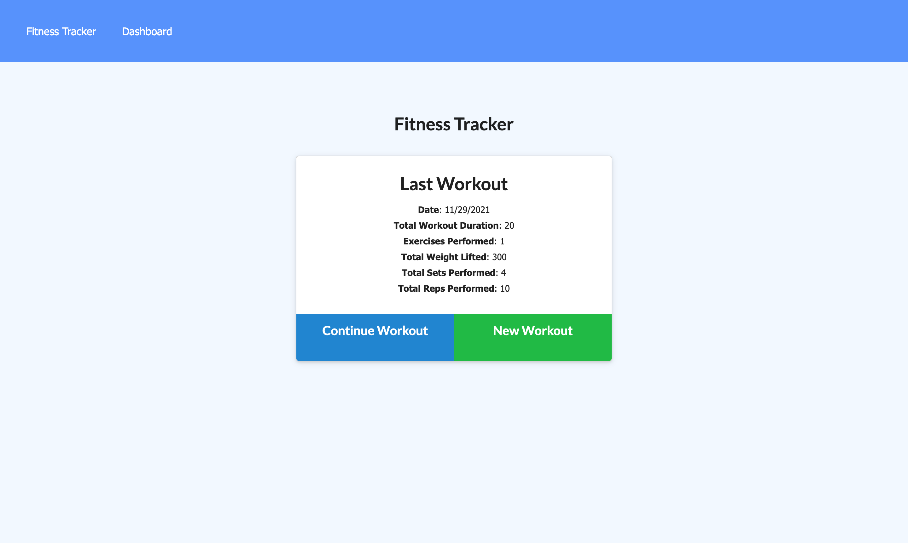

# Fitness Tracker
[https://fitness-tracker.herokuapp.com/](https://fitness-tracker-18-homework.herokuapp.com/)

## Description 
An app that allows you to view, create, and track daily workouts. 

### User Story 
```md 
As a user, I want to be able to view create and track daily workouts.
I want to be able to log multiple exercises in a workout on a given day. I should also be
able to track the name, type, weight, sets, reps, and duration of exercise. 
If the exercise is a cardio exercise, I should be able to track my distance traveled.
```

### Credits 
- Ismeny Saguilan
- Damien Luzzo

### License 

